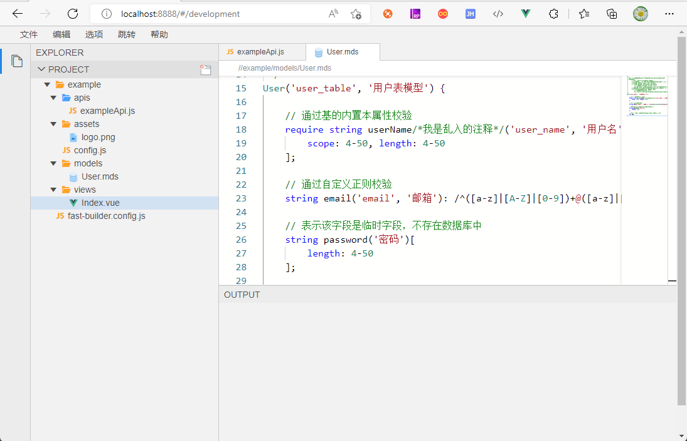
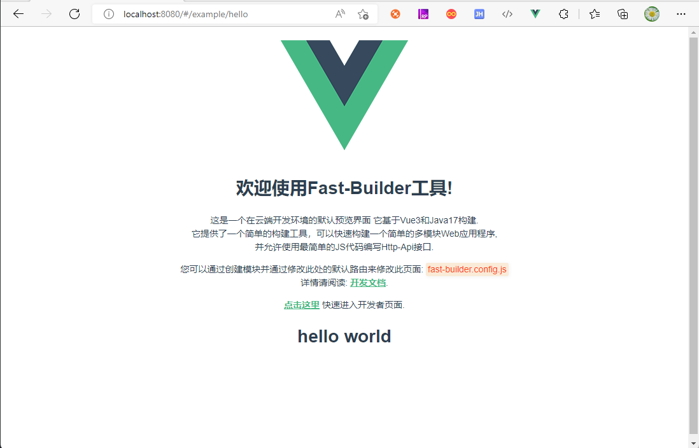
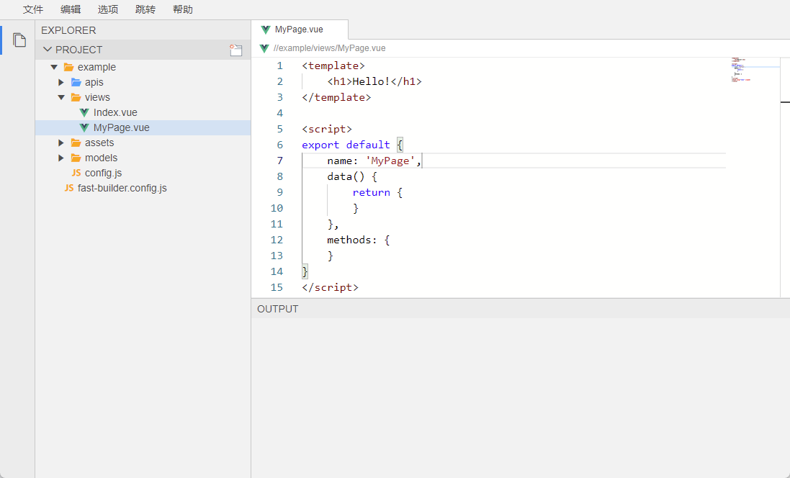
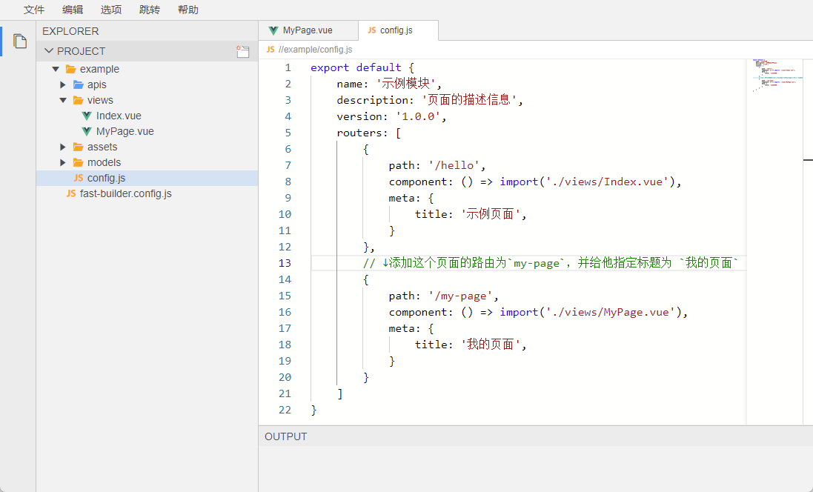
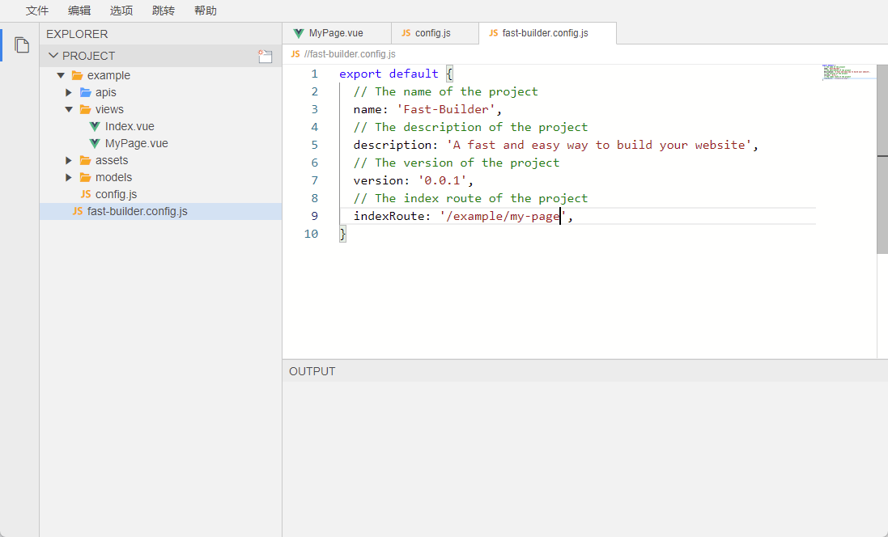

这是一款让人上瘾的新一代开发神器，彻底告别Controller、Service、Dao等传统开发方式。

## 前言
"偷懒"可以说是技术创新非常重要的原因之一，很多技术，框架的革新，本质上就是为了能更好的"偷懒"，FastBuilder在让开发者最大程度“偷懒”的同时，扩展了前端开发者的工作领域且无需额外的学习成本。

## 什么是FastBuilder？
"FastBuilder" 基于java17 和 vue3 快速开发框架，服务端99.99%以上的功能只需要配置数据模型编写“Fast脚本”就能完成开发，另外剩下的0.01%也可以通过FastBuilder内置的API，一两行代码就可以搞定！不需要发布部署，不需要重启来实现研发团队的快速编码，提测以及回归。实现了服务端研发效率600%-900%的提升，人力成本减少了5倍。

## 定位
1. 拒绝CRUD。用尽可能简单的方式，完成尽可能多的需求。通过约定的方式实现统一的标准。告别加班，拒绝重复劳动，远离搬砖。
2. 开发者全栈化，秩序一名前端程序员就可以独立完成整个项目的开发工作。
3. 省去编译、部署、发布成本，所写即所得，实时预览最终结果。

## 特性
- 快速开发 API 接口。后端不再定义 Controller，Service，Dao，Mybatis，xml，Entity，VO 等对象和方法。
- 快速对接 API 接口。前端不在定义各种Request方法，不需要再封装各种请求体。
- 可视化界面，将入参自动封装到可执行的脚本上。
- 只需编写一行代码即可完成大部分的业务需求开发，使用难度级别（测试 or 运维）也可参与开发。
- 在线动态编译，无需重启，即时生效，多数据源操作。
- 远程一键发布到线上环境。
- 代码提示，SQL 提示，语法提示。
- 经过多次项目验证，传统业务型开发，服务端效率能够提升 9-10 倍，前后端联调提升效率 2 倍，测试效率 3 倍提升。

### 传统标准的开发步骤
- 后端增加一张表
- 后端创建实体对象，映射这张表
- 后端创建 API 入参 VO
- 后端创建 API 出参 VO
- 后端创建 Controller
- 后端创建 Service
- 后端创建 Dao
- 后端创建 Mapper，xml 或者 JPA
- 后端进行入参校验
- 后端反复重启，进行接口自测
- 后端编写 API 文档
- 后端完成一个接口开发
- 前端画出页面
- 前端阅读 API 文档并封装接口
- 前端联调
- 前端进行入参校验
- 完成一个功能点

### FastBuilder开发步骤
- 创建数据模型
- 编写“Fast脚本”
- 画出页面
- 完成一个功能点

介于FastBuilder与现有的开发步骤差异过大，更多的细节不在这里一一罗列，可以再实际使用中体验到各种细节的改进，比如自动同步数据库数据结构、形参自校验、快速的模型描述语言等。

# 快速开始
## 前期准备工作
#### 创建数据库
这里使用Docker来安装MYSQL
````
docker run --name mysql -e MYSQL_ROOT_PASSWORD=root \
    -v /home/mysql/data:/var/lib/mysql \
    -p 3306:3306 \
    -d mysql:8.0.18 \
    --character-set-server=utf8mb4 --collation-server=utf8mb4_unicode_ci --max_connections=4096
````
创建完MYSQL后，创建一个库，比如“example_db”，之后的介绍都会在“example_db”库中进行。
````
docker exec -i mysql sh -c 'exec mysql -uroot -proot -P 3306 -h 127.0.0.1 -e "CREATE DATABASE `example_db`;"'
````

#### 安装FastBuilder
这里的FastBuilder是安装在开发服务器中，并非客户机，因此客户机不需要额外安装任何工具，只需要有一个浏览器即可。
安装FastBuilder的时候，配置好刚才创建的数据库, 如下：
````
docker run --name=fast-builder \
    -p 8080:8080 -p 8888:8888 \
    -e MYSQL_HOST=172.17.0.1:3306 \
    -e MYSQL_DB_NAME=fast_build_template \
    -e MYSQL_USERNAME=root \
    -e MYSQL_PASSWORD=root \
    -d guoshengkai/fast-builder:latest
````
此时方位开发端口：http://localhost:8888， 看到以下页面即为安装成功：

首次启时会拉取相应的前端依赖，动稍等片刻，即可通过访问 http://localhost:8080 看到实时预览页面：

首次部署后，会自动创建一个“example”模块，通过开发者界面可以看到：
- 一个模块由`apis`、`views`、`asstes`、`models`、`config.js`构成；
- 一个项目由多个`模块`和一个`fast-builder.config.js`构成；

通过欢迎页面，我们可以看到`fast-builder.config.js`是整个项目的核心配置文件，现在我们试着修改他的主页。
- 在`views`中创建一个`MyPage.vue`文件（修改完记得Ctrl+S）

- 在config.js中，添加这个页面的路由为`my-page`，并给他指定标题为 `我的页面`（修改完记得Ctrl+S）

- 修改`fast-builder.config.js`的默认路由为`example`模块下的`my-page`（修改完记得Ctrl+S）

- 此时访问8080端口，默认路由将变为你刚刚创建的页面：


## 开发工作
#### 创建一个模型
在`models`中创建Persion模型：
````
Persion('my_persion', '人员'){
    string persionName('persion_name', '人员姓名');
    int persionSex('persion_sex', '人员年龄');
}
````
为了提高效率简化繁琐的操作步骤，在这里我们使用了一种自定义语法来创建模型，暂且叫他“Model Describe Script”，简称“MDS”。
这种语法比编写Java实体、d.ts、建表语句或者图形化的操作方式效率更高。我们的目的是提高开发效率、减少开发成本，怎么高效就怎么做，而非所谓的“为了去代码化而去代码化”，相信大家已经看出来了。
#### 创建一个接口
在`apis`中新建一个`PersionApi.js`
````
export default {
    addAndListPersions: {
        description: '添加一个人员，并且列出所有的人员列表',
        execute() { 
            // 添加一个人员
            const persion = new Model.Persion();
            persion.persionName = '张三';
            persion.persionSex = 1;
            Dao.PersionDao.insert(persion);

            // 列出所有的人员列表
            return Dao.PersionDao.list(Where.emptyWhere());
        }
    }
}
````

#### 页面调用接口
